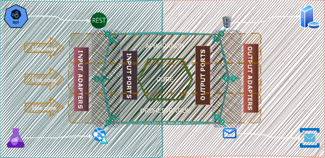

# 🍝 PASTA Architecture

> **PASTA** — _Ports🔹Adapters🔹Slices🔹Typed Abstractions🔹(Anti-Layers)_

A minimalist, modern architecture for building modular, testable, and maintainable systems in C#, with:
- No interfaces.
- No anemic layers.
- No framework-driven indirection.

Just functional slices of real business logic, with typed ports and clean boundaries.

---
## ✨ Philosophy

PASTA is an architectural style for modern .NET (and beyond) projects that favors:

* Functionally cohesive, vertically sliced designs

* Delegate-based composition over interface-based ceremony

* Clear separation between core logic and I/O without overengineering

PASTA takes inspiration from Hexagonal Architecture, Functional Core/Imperative Shell, and Vertical Slice Architecture, but distills them into a leaner, practical style.

---

## 📜 PASTA Manifesto

### ❌ No More Overengineering

* Interfaces are not sacred. Use delegates, records, and lambdas instead.

* DI containers should wire up dependencies, not define your architecture.

* Fewer layers, more clarity. Logic lives where it belongs.

### ✅ Embrace Simplicity with Power

* Functional core for business rules — pure, testable, composable.

* Imperative shell for wiring, I/O, and coordination.

* Keep logic close to where it’s used with vertical slices.

### 📦 Ports & Adapters Done Right

* Ports are typed function signatures, not interfaces.

* Adapters are infrastructure implementations of these ports.

* In tests, replace ports with pure functions. No mocking frameworks needed.

```csharp
// A port
public delegate Task<Result<Customer>> GetCustomerById(CustomerId id);

// An adapter
public static class CustomerAdapter
{
    public static async Task<Result<Customer>> GetCustomerById(CustomerId id) => ...
}
```

### 🧩 Service Handlers: Explicit and Focused

```csharp
public sealed record CreateOrderHandler(OrderRepository Repo, ILogger Log)
{
    public async Task<Result<Order>> Handle(CreateOrderCommand cmd)
    {
        // business logic here
    }
}
```
* No base classes, no magic.

* Everything needed is passed via constructor (record positional args).

* Handlers can be composed and reused.

### 🧠 Typed Abstractions Over Interfaces

* Prefer discriminated unions, result types, and domain primitives.

* Abstractions should describe what not how.

* Treat functions as first-class citizens.

```csharp
public delegate Task<Result<Order>> PlaceOrder(CustomerId id, ProductCode code);
```

### 🧪 Test by Design

* No need for mocks when logic is in pure functions.

* Test core logic in isolation.

* Service handlers are easy to test with hand-written or inline dependencies.
---

## 📈 Architecture Diagram



> Each use case forms a **vertical slice**: its own logic, ports, and orchestration.  
> No split projects per "layer". Functional cohesion lives within the slice.

---

## 💡 Key Concepts

| Component                | Role                                                                 |
|--------------------------|----------------------------------------------------------------------|
| **Use Case (Slice)**     | Self-contained unit: handler, ports, business logic                  |
| **Input Adapter**        | Accepts external input (HTTP, CLI, etc.), calls port delegate        |
| **Output Adapter**       | Implements outbound ports (DB, Email, Storage)                       |
| **Input Port**           | Delegate/function signature invoked by adapter                      |
| **Output Port**          | Delegate passed into use case to abstract side-effects              |
| **Core**                 | Pure logic: types, validators, calculators, etc.                     |
| **App Orchestration**    | Wires ports to logic, defines what happens when and in what order    |

---

## 🧪 Sample Code

### 🧩 Use Case Slice: `CreateOrder`

```csharp
// Input Port
public delegate Task<Result<OrderCreated>> CreateOrderHandler(CreateOrderCommand cmd);

// Output Port
public delegate Task<bool> SaveOrder(Order order);

// Application orchestration
public static CreateOrderHandler CreateOrderUseCase(SaveOrder saveOrder)
    => async cmd =>
    {
        var order = Order.Create(cmd.CustomerId, cmd.Items);
        var success = await saveOrder(order);

        return success
            ? Result.Success(new OrderCreated(order.Id))
            : Result.Failure("Could not save order.");
    };
