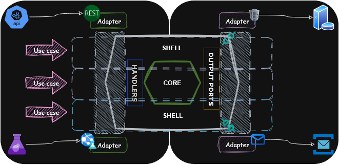
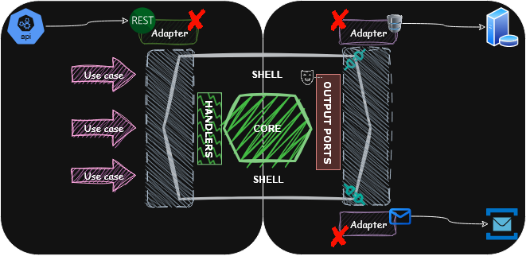

> **PASTA** — _Ports🔹Adapters🔹Slices🔹Typed Abstractions🔹(Anti-Layers)_

A minimalist, modern architecture for building modular, testable, and maintainable systems in C#, with:
- No interfaces.
- No anemic layers.
- No framework-driven indirection.

Just functional slices of real business logic, with typed ports and clean boundaries.

---

## 📈 Architecture Diagram



> Each use case forms a **vertical slice**: its own logic, ports, and orchestration.  
> No split projects per "layer". Functional cohesion lives within the slice.

---

## 💡 Key Concepts

| Component            | Role                                                            |
| -------------------- | --------------------------------------------------------------- |
| **Use Case (Slice)** | Self-contained unit: handler, ports, business logic             |
| **Input Adapter**    | Accepts external input (HTTP, CLI, etc.), calls port delegate   |
| **Output Adapter**   | Implements outbound ports (DB, Email, Storage)                  |
| **Handlers**         | Just functions or static orchestrators that implement use-cases |
| **Output Port**      | Delegate passed into use case to abstract side-effects          |
| **Core**             | Pure logic: types, validators, calculators, etc.                |
---

## 💭 Philosophy

PASTA is an architectural style for modern .NET (and beyond) projects that favors:

* Functionally cohesive, vertically sliced designs

* Delegate-based composition over interface-based ceremony

* Clear separation between core logic and I/O without overengineering

PASTA takes inspiration from Hexagonal Architecture, Functional Core/Imperative Shell, and Vertical Slice Architecture, but distills them into a leaner, practical style.

---

## 🪶PASTA Manifesto

> "Layered systems are like overcooked spaghetti — sticky, tangled, and a pain to digest. PASTA serves it al dente."

### ❌ No More Overengineering

* Interfaces are not sacred. Use delegates, records, and lambdas instead.

* DI containers should wire up dependencies, not define your architecture.

* Fewer layers, more clarity. Logic lives where it belongs.

### ✅ Embrace Simplicity with Power

* Functional core for business rules — pure, testable, composable.

* Imperative shell for wiring, I/O, and coordination.

* Keep logic close to where it’s used with vertical slices.

### 📦 Ports & Adapters Done Right

* Ports are typed function signatures, not interfaces.

* Adapters are infrastructure implementations of these ports.

* In tests, replace ports with pure functions. No mocking frameworks needed.

### 🧩 Service Handlers: Explicit and Focused

* No base classes, no magic.

* Everything needed is passed via constructor (record positional args).

* Handlers can be composed and reused.

### 🧠 Typed Abstractions Over Interfaces

* Prefer discriminated unions, result types, and domain primitives.

* Abstractions should describe what not how.

* Treat functions as first-class citizens.

```csharp
public delegate Task<Result<Order>> PlaceOrder(CustomerId id, ProductCode code);
```

### 🧪 Test by Design

* No need for mocks when logic is in pure functions.

* Test core logic in isolation.

* Service handlers are easy to test with hand-written or inline dependencies.
---

## 🎯 Testing Strategies

| Test Type           | Scope                                    | What to Stub                                         | Purpose                                                    |
|---------------------|------------------------------------------|------------------------------------------------------|------------------------------------------------------------|
| **Unit Tests**      | `Core` + optionally `Handlers`           | Everything (Ports, Adapters, I/O)                    | Pure logic, correctness, no side effects                   |
| **Component Tests** | `Use Case → Handlers → Adapters (owned)` | Only 3rd-party/external adapters (e.g. SMTP, Stripe) | Verify application behavior across multiple layers/modules |


## Unit testing
PASTA enforces unit testing for Core (pure domain logic: rules, validations, calculations)
and Handlers (if they orchestrate logic without side effects). The goal is to test **individual
behaviors in isolation and ensure logic correctness unders all conditions**.

It should be fast, deterministic, no I/O



## Component testing

PASTA encourages component testing for full use case execution — 
from API adapter through handlers, core, and owned adapters.
The goal is to verify the behavior **of a complete vertical slice of the system with real infrastructure components** (e.g. in-memory DB, message broker),
while **stubbing only external dependencies you don’t own** (e.g. 3rd-party APIs, SMTP).
It ensures correctness across integrated parts you control, with realistic I/O and boundary behavior.


---
## </> Sample Code